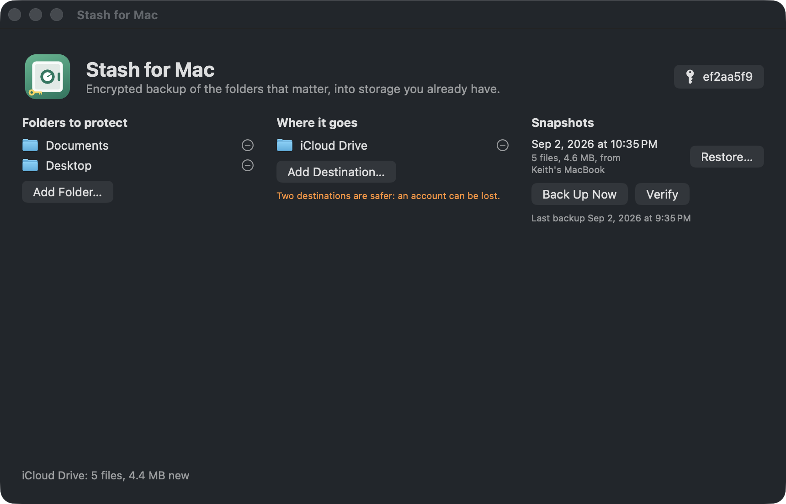
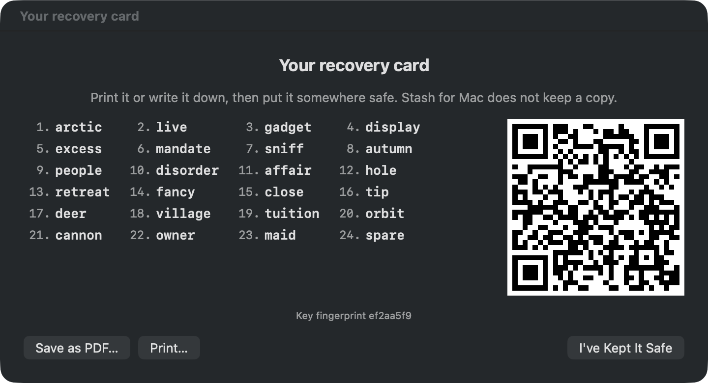

# Stash for Mac

Encrypted backup of the folders that matter, into the free storage you already have: the Google
Drive that comes with Gmail, the OneDrive that comes with Microsoft 365, iCloud Drive, Dropbox, an
external disk, a NAS. The provider only ever holds scrambled blobs. You hold the key, as 24 words
and a QR code on a card.

Free, MIT licensed, no account, no server, no subscription. Same family as
[Tidy for Mac](https://github.com/keithadler/tidymac) and [Clip for Mac](https://github.com/keithadler/clipmac).

<p align="center"></p>
<p align="center"></p>

**Status: works, not yet released.** Key and recovery card, encrypted chunks and manifests,
backup into any folder, restore, and verify are built and tested end to end. Schedules, a menu bar
presence, the Google Drive and OneDrive APIs, help pages and a release are still to come.

## What it refuses to do

- Upload anything the provider can read. Chunks are encrypted on the Mac and named by a keyed hash,
  so the provider cannot tell what a blob is, or whether two people stored the same file.
- Keep a copy of your key anywhere but this Mac's Keychain. The recovery card is the only backup of
  it, and the app says so before you can continue. Lose the card and the backup is unreadable, by
  anyone, including you.
- Restore a chunk that fails authentication. Damaged or tampered data is reported, never written.
- Open cloud placeholders while reading your folders (a file that only exists in iCloud is skipped
  and listed, not downloaded behind your back).

## The key

Stash for Mac makes a random 256-bit key. You keep it three ways, all on one printable card:

- **24 words** (BIP-39 encoding, with a checksum word, so a typo is caught before restore starts)
- **A QR code** of the same key, scannable by a phone camera or by the app on a new Mac
- **A fingerprint**, eight characters, so two cards can be told apart

Everything else is derived from the key with HKDF: the chunk encryption key, the chunk naming key,
the manifest key. There is no password, so there is nothing to guess.

## Threat model, in one screen

Protects against a breached or subpoenaed cloud account, a curious provider, a lost laptop with the
sync folder on it, and someone who has your Google or Microsoft password. Does not protect against
malware running on the Mac while the app has the key in memory, a lost recovery card, or someone
with account access deleting the ciphertext (point it at two destinations). The provider can see
when you back up and roughly how much. Full text: [docs/threat-model.md](docs/threat-model.md).

## Cryptography

Standard primitives from Apple's frameworks only, no homemade parts: ChaChaPoly for chunks and the
manifest, HKDF-SHA256 for key derivation, HMAC-SHA256 for chunk names, SecRandom for the key.
Chunk format: `STSH1` + 12-byte nonce + ciphertext + 16-byte tag. Test vectors in
`Sources/StashMac/Tests`.

## How a backup is stored

Inside the destination folder: `Stash for Mac/<key fingerprint>/chunks/<ab>/<64 hex>` for the
encrypted 4 MB chunks, `manifests/<timestamp>.stsm` for each encrypted snapshot, and a README that
tells whoever finds the folder what it is and how to restore it. Identical content is stored once
per stash. A second backup uploads only chunks the destination doesn't already have.

## Command line

```
stashmac key new | show | card card.pdf | restore "<24 words>" | restore --qr card.png | forget
stashmac add ~/Documents            stashmac dest ~/Library/CloudStorage/GoogleDrive-you@gmail.com/My\ Drive
stashmac backup                     every folder to every destination; --json for scripts
stashmac snapshots                  stashmac restore latest ~/Desktop/Restored [--only photos/2024]
stashmac verify                     opens every chunk of the latest snapshot, restores one random file
stashmac status                     stashmac selftest
```

Exit codes: 0 fine, 1 something to look at (placeholders skipped, nothing to back up), 2 problem.

## Roadmap

1. Schedule (hourly, daily) with a menu bar item showing the last backup and the next one.
2. Weekly automatic verify with a plain-language result.
3. Google Drive and OneDrive over their APIs with app-only scopes, for Macs without the desktop apps.
4. Help pages, Spanish, screenshots, release.

## Building

macOS 14 or later and the Command Line Tools. No Xcode, no dependencies.

```bash
./build-app.sh --install --run     # universal build, installs, symlinks stashmac
stashmac selftest                  # the suites, no Xcode needed
swift test                         # same suites under XCTest where Xcode exists
```

## License

MIT. See LICENSE. Mac and macOS are trademarks of Apple Inc.; Google Drive, OneDrive, iCloud and
Dropbox belong to their owners and are named only to identify those services.
